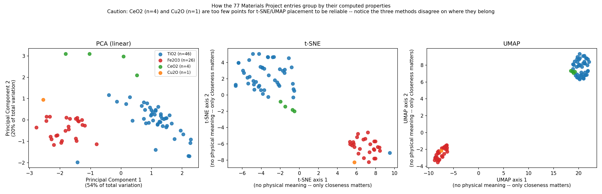

# MPExplorer

**A live Materials Project explorer for TiO2, Fe2O3, CeO2, and Cu2O** — search, download,
and visualize real DFT-computed materials data, with the DFT methodology's known failure
modes surfaced explicitly for each material rather than hidden behind a single disclaimer.

Part of a four-repo portfolio demonstrating ML and data engineering applied to materials
science: [`CatalystML`](https://github.com/teja2792/CatalystML) (property prediction),
[`ExplainableCatML`](https://github.com/teja2792/ExplainableCatML) (cross-method
explainability), [`CatalystBO`](https://github.com/teja2792/CatalystBO) (Bayesian
optimization), and this repo — the only one of the four built on a live, real external
database rather than synthetic or literature-calibrated data.

---

## Highlights

- Live integration with the real Materials Project REST API (`mp-api`) — not synthetic
  or hypothetical data. Every number in this repo traces back to an actual DFT calculation.
- Found and documented **three distinct, verified DFT failure modes** across the four
  target materials — not a single blanket "GGA underestimates by ~40%" statement:
  TiO2's DFT-stable polymorph is the wrong one (anatase, not rutile); Fe2O3 is predicted
  as a metal even with its Hubbard-U correction; Cu2O's gap is underestimated by ~75%,
  the material this repo's author's own published photocatalysis work is built on.
- Investigated *why* Cu2O has only 1 database entry versus 46/26/4 for the other three,
  and traced it to Materials Project's structure-substitution methodology plus real,
  cited literature on Cu2O's limited known polymorphs — not left as an unexplained gap.
- Caught and corrected my own earlier mistake in this build: I initially cited a Ce
  Hubbard-U value as if it were Materials Project's standard convention. The live data
  proved it wrong (all CeO2 entries came back as plain GGA), and the error was fixed
  rather than left standing.
- Elastic modulus coverage is reported per-material, not as one flat percentage —
  revealing Fe2O3 has 0% coverage, including its one real, stable structure.
- Property-space PCA/UMAP/t-SNE visualization (deliberately not composition-only, which
  would be trivial with just 4 unique formulas), with explicit warnings when sample
  sizes are too small (CeO2: n=4, Cu2O: n=1) for t-SNE/UMAP placement to be reliable.
- A full interactive Streamlit app — Search, Download, and three Visualize modes
  (3D crystal structure, periodic table, dimensionality reduction) — with a live
  "add a new formula" query, not just a static dashboard over a frozen CSV.

---

## Technical Skills Demonstrated

**REST API integration & defensive engineering** — built against Materials Project's
`mp-api` client, iteratively resolved multiple real field-name mismatches using the
API's own error messages (which conveniently list valid fields), and wrote defensive
parsing for ambiguous nested-object responses (e.g., `bulk_modulus` returning either a
plain float or a nested voigt/reuss/vrh object depending on context).

**Scientific literature research & verification** — sourced and cited real literature for
DFT methodology caveats (GGA band-gap underestimation, Hubbard-U correction lists,
rutile/anatase stability ordering, Cu2O high-pressure phases), rather than asserting
technical claims from memory. One claim was checked against live data, found wrong, and
corrected in place.

**Critical, self-correcting scientific reasoning** — treated the live API output as
ground truth to check assumptions against, not just a data source; used it to catch and
fix an incorrect methodology claim mid-build.

**Data completeness & honesty reporting** — per-material, per-property coverage tracking
(not blanket statistics), explicit `is_stable` filtering so hypothetical polymorphs don't
drown out real materials in visualizations, and no imputation of the 77%-missing elastic
modulus column.

**Dimensionality reduction methodology** — PCA (linear) vs. t-SNE/UMAP (nonlinear,
neighborhood-preserving) built from computed-property space rather than composition,
with correct statistical caveats about small-sample reliability.

**Full-stack data application development** — a Streamlit app combining live API queries,
locally cached data, a custom plotly-based 3D crystal structure viewer, and a hand-built
periodic table visualization, wired together with session-state management.

**Software engineering discipline** — a test suite split between deterministic
snapshot-based tests and live-API tests that skip gracefully without credentials; git
hygiene; `requirements.txt` discipline; defensive coding against uncertain API response
shapes.

---

## Advantages

- Built on a real, live, extensible database — not synthetic data, and not frozen to
  just four formulas (the app can query any formula on demand).
- DFT methodology (GGA / GGA+U / r2SCAN) is tracked and displayed per entry, not
  glossed over with a single accuracy disclaimer.
- Missing-data reporting is granular (per material, per property) rather than a single
  aggregate completeness percentage that would hide exactly where the gaps are.
- The app is genuinely interactive and extensible, not a static report.
- Three different dimensionality-reduction methods are offered side by side specifically
  so their disagreements are visible, rather than picking one and presenting it as
  authoritative.

## Disadvantages / Limitations

- The band-gap methodology comparison table is hand-curated per material, deliberately —
  accuracy over automatic scalability. Adding a fifth material means manually verifying
  its literature reference, not just re-running a script.
- Elastic tensor data is too sparse (~23% coverage in this dataset) to be a reliable
  primary analysis axis; it's included but should not be leaned on heavily.
- CeO2 (n=4) and Cu2O (n=1) — genuinely, Cu2O (n=1) — are too small for t-SNE/UMAP
  placement to be statistically meaningful. This is a real limitation of the four
  target materials chosen, not something fixable in code.
- The crystal structure viewer requires a live API call every time; there's no offline
  cache of full structure objects, only summary properties.
- The app deliberately does not apply any band-gap correction factor. That's the right
  scientific call, but it also means a user who skips the Methodology tab could still
  misread a raw DFT number as accurate.
- The periodic table view currently shows only one elemental property (electronegativity);
  it's a single lens, not a multi-property explorer.

---

## Results

### Dataset summary (4 target materials, 77 total entries)

| Formula | Entries | DFT methodology breakdown |
|---|---|---|
| TiO2 | 46 | mostly GGA, 2 r2SCAN |
| Fe2O3 | 26 | 100% GGA+U |
| CeO2 | 4 | 100% GGA (no Hubbard correction available for Ce) |
| Cu2O | 1 | GGA |

### Elastic modulus coverage by material (not a flat percentage)

| Material | Coverage |
|---|---|
| TiO2 | 14/46 (30%) |
| Fe2O3 | 0/26 (0%) -- including its one real, stable structure |
| CeO2 | 3/4 (75%) |
| Cu2O | 1/1 (100%) |

### DFT vs. literature: verified failure mode per material

| Material | MP stable phase | DFT band gap | Experimental range | Failure mode |
|---|---|---|---|---|
| TiO2 | anatase (I4₁/amd) | 2.06 eV | 3.0-3.2 eV | **Wrong stable polymorph** -- true ground state is rutile |
| Fe2O3 | hematite (R-3c) | 0.00 eV | 2.0-2.2 eV | **Qualitative failure** -- predicted metallic despite Hubbard-U correction |
| CeO2 | fluorite (Fm-3m) | 2.00 eV | 2.6-3.9 eV | Quantitative underestimate -- no Hubbard correction available for Ce |
| Cu2O | cuprite (Pn-3m) | 0.51 eV | 2.1-2.2 eV | **Largest quantitative miss (~75%)** -- this repo author's own research compound |

### Property-space visualization

PCA's first two components explain 74% of total variation. All three methods agree
TiO2 and Fe2O3 form distinct groups; they disagree on where CeO2 and Cu2O belong --
expected given those groups have only 4 and 1 entries respectively.

### Test suite

13 tests passing: 11 deterministic (data-snapshot and geometry checks), 2 live-API
(auto-skipped without `MP_API_KEY`).

---

## Method (phases)

0. Materials Project account/API key setup, repo scaffolding
1. Data layer: formula search across polymorphs, DFT methodology (`energy_type`) tracking
2. Elastic modulus extraction with per-material coverage reporting
3. Methodology-aware band gap comparison (no blanket correction factor)
4. Visualization: PCA/UMAP/t-SNE property-space plots, 3D crystal structure viewer,
   periodic table heatmap, all assembled into a Streamlit app
5. Test suite (snapshot + live-API, auto-skipping)
6. This README

## How to run
pip install -r requirements.txt
setx MP_API_KEY "your_key_here"        # then restart the terminal
python scripts/build_dataset.py         # Phase 1-2: pull live data
python src/band_gap_reference.py        # Phase 3: methodology comparison table
streamlit run app.py                    # Phase 4: the full app
pytest tests/test_mpexplorer.py -v      # Phase 5: test suite

## References

- [Materials Project API Documentation](https://docs.materialsproject.org/downloading-data/using-the-api)
- [Understanding Structures and Properties in the Materials Project](https://docs.materialsproject.org/methodology/materials-methodology/understanding-structures-and-properties-in-the-materials-project)
- [Hubbard U Values | Materials Project Documentation](https://docs.materialsproject.org/methodology/materials-methodology/calculation-details/gga+u-calculations/hubbard-u-values)
- [Subtlety of TiO2 phase stability: Reliability of DFT predictions](https://pubs.aip.org/aip/jcp/article/150/1/014105/152303/Subtlety-of-TiO2-phase-stability-Reliability-of)
- [Toward a Consistent Prediction of Defect Chemistry in CeO2](https://pubs.acs.org/doi/10.1021/acs.chemmater.2c03019)
- [High Pressure Behaviors and a Novel High-Pressure Phase of Cu2O](https://www.frontiersin.org/journals/earth-science/articles/10.3389/feart.2021.740685/full)